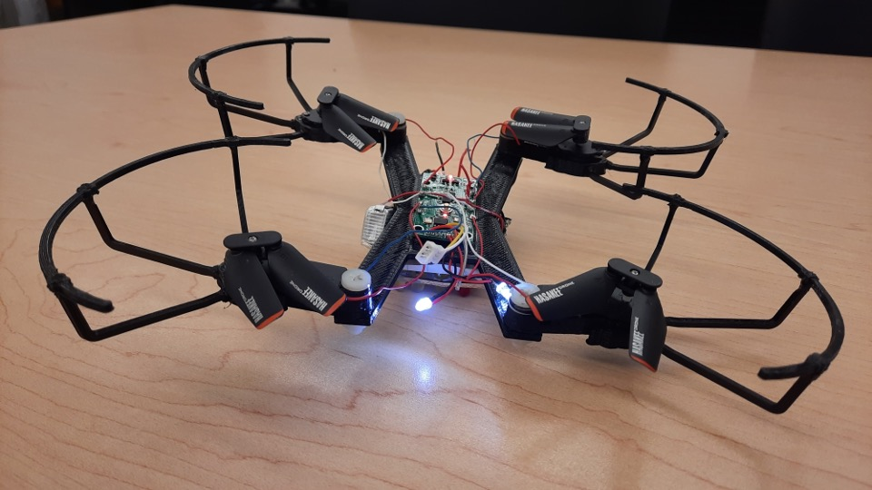
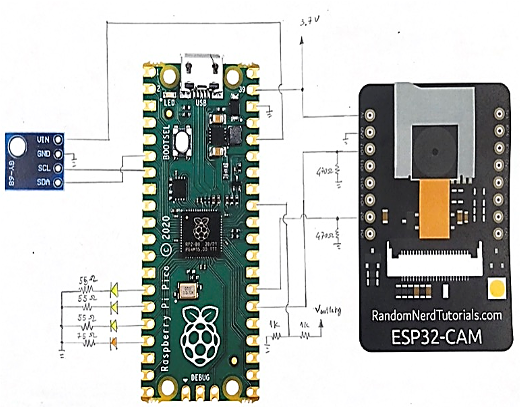
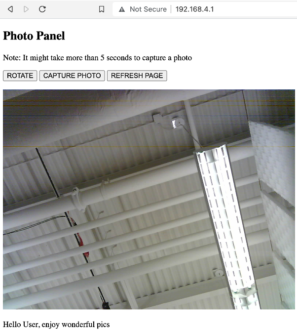
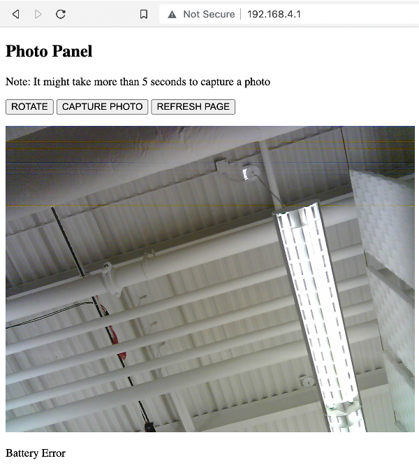

# aerophone-electrical-controller

In this project, I collaborate with 3 mechanical engineering student and 1 electrical student to convert an inexpensive commercial drone into a flycam. On the electrical side, we achieve the flycam functioncality by adding an ESP32-CAM module and a Raspberry Pi Pico controller. The ESP32-CAM code was written in C++ with Arduino libraries, while Pi Pico code was written in MicroPython.

 The ESP32-CAM code was written in C++ with Arduino libraries. The ESP32-CAM module can take picture while acting as a Web Server. A simple Web UI for user's phone is also built. The ESP32-CAM is configured to be an Access Point. Upon connecting to ESP32-CAM module, user's phone can communicate with the ESP32-CAM via HTTP requests. From the Web Interface on the phone, the user can command the module to take a picture. The user can also receive pictures and receive alerts about the module's operational status: height and battery level.

The Pi Pico code was written in MicroPython. The module reads voltage level of the connected battery via ADC pin, and uses its interface with 4 LEDs to indicate battery level. The Pico is also connected with a BMP180 barometric sensor. The controller reads the data from the sensor via I2C connection and statistically processes it. When data from the sensor shows questionable height or the battery level is too low, the Pi Pico communicates with ESP32-CAM via GPIOs to signal an error.